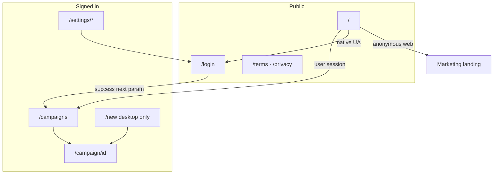

# SlidePress — Repository architecture

Technical map for AI assistants and contributors. **Product behavior** is in [`client-features.md`](client-features.md).

**Claude upload:** See [`claude-project.md`](claude-project.md) for Project instructions and file checklist.

*Last updated: June 25, 2026*

---

## High-level flow

```
User → Next.js (Vercel) → Supabase (auth, Postgres, Realtime, Storage)
                        → Gemini (slide copy, voiceover, captions, URL ingest)
                        → Fal.ai (slide images, video compose webhooks)
                        → ElevenLabs (TTS preview, narration, video audio)
                        → Platform APIs (YouTube, TikTok, Instagram OAuth + publish)
                        → Stripe / RevenueCat (billing webhooks → usage_balances)
```

Native apps (Capacitor) load the same Vercel deployment in a WebView — no separate API.

---

## Directory layout

| Path | Purpose |
|------|---------|
| `app/` | Next.js App Router — pages, layouts, API routes |
| `app/api/` | Serverless route handlers (`route.ts` per endpoint) |
| `app/components/` | Shared React components |
| `app/campaign/[id]/` | Campaign workspace (slides, video, publish) |
| `utils/` | Business logic, API clients, helpers (no `lib/` alias) |
| `utils/supabase/` | `server.ts`, `client.ts`, admin client |
| `utils/tts/` | ElevenLabs synthesis, voice catalog, narration cache |
| `utils/campaign-generation.ts` | Gemini campaign text + Zod schemas |
| `utils/plan-limits.ts` | Tier caps (free / creator / agency) |
| `utils/usage-limits.ts` | Credit read, assert, consume |
| `types/` | Shared TypeScript types |
| `supabase/migrations/` | SQL migrations (apply before deploy) |
| `ios/`, `android/` | Capacitor native projects |
| `docs/` | Internal runbooks and product docs |
| `.cursor/rules/` | Cursor AI project rules (`.mdc`) |

---

## Key API routes

| Route | Purpose |
|-------|---------|
| `POST /api/generate-text` | Create campaign + Gemini slide/voiceover copy |
| `POST /api/campaigns/ingest-url` | Website URL → topic suggestions |
| `POST /api/regenerate-slide` | Single slide image regen (Fal queue) |
| `POST /api/generate-captions` | Platform captions (Gemini) |
| `POST /api/tts/preview` | Per-slide voice preview (ElevenLabs) |
| `POST /api/export-audio` | Narration ZIP |
| `POST /api/export-video` | MP4 export (TTS + Fal FFmpeg) |
| `GET /api/exports/:id` | Poll export status |
| `POST /api/webhooks/fal` | Fal image + video completion |
| `POST /api/webhooks/stripe` | Stripe subscription fulfillment |
| `POST /api/webhooks/revenuecat` | Mobile IAP fulfillment |
| `GET /api/cron/refill-free-credits` | Free-tier calendar-month credit refill |
| `/api/platforms/*` | OAuth connect, publish, status |

---

## Campaign lifecycle

1. **Create** — `generate-text` inserts `campaigns` + `slides` (bulk)
2. **Images** — Fal queue; webhook updates `slide_images`; Realtime pushes to UI
3. **Captions** — auto-trigger when images complete → `platform_captions`
4. **TTS / video** — optional; cached in `tts-cache` storage bucket
5. **Publish** — uses `exports` (video) + `platform_captions` + `platform_connections`

Journey strip states: Copy → Assets (images + captions) → Video → Publish.

---

## Navigation & routing

SlidePress uses **Next.js App Router** for top-level routes. Most “navigation” inside the campaign workspace is **client state** (tabs, scroll targets, sheets, overlays) — not new URLs.

**Product-level overview** of shell and workspace tabs: [`client-features.md`](client-features.md#app-navigation). **Native OAuth / deep links**: [`capacitor.md`](capacitor.md).

### Layers

| Layer | Mechanism | Examples |
|-------|-----------|----------|
| **Routes** | `app/**/page.tsx`, `Link`, `router.push/replace`, server `redirect()` | `/campaigns`, `/campaign/[id]` |
| **Query params** | `searchParams`, `useSearchParams` | `?tab=publish`, `?auto_images=1`, `?brand=` |
| **In-page** | React state, `scrollToCampaignSection` | Workspace tabs, journey strip jumps |
| **Overlays** | Fixed modals / bottom sheets (no route change) | Create sheet, draft-build spinner, video export |
| **Native** | Capacitor `appUrlOpen`, push tap, custom scheme | `co.slidepress.app://campaign/{id}` |



### Route map

| Route | Auth | Purpose |
|-------|------|---------|
| `/` | Optional | Marketing landing; signed-in users → `/campaigns`; native WebView → `/login` |
| `/login` | Public | Sign in / sign up; `?next=` safe relative return path (default `/campaigns`) |
| `/auth/callback` | Handler | Supabase PKCE exchange → redirect to `?next=` or `/campaigns` |
| `/campaigns` | Required | Campaign list; brand filter via `?brand={id}` |
| `/new` | Required | Full-page create form (**desktop only**; mobile redirects to `/campaigns`) |
| `/campaign/[id]` | Required | Campaign workspace; hidden empty campaigns redirect to list |
| `/settings` | Required (layout) | Hub (mobile) / desktop split view |
| `/settings/account` | Required | Email, password reset form when `?reset=1` |
| `/settings/brands`, `/settings/brands/[id]` | Required | Brand kit list + detail |
| `/settings/security` | Required | Biometric lock (native) |
| `/settings/usage` | Required | Plan, credits, upgrade |
| `/settings/connected-accounts` | Required | YouTube / TikTok / Instagram OAuth |
| `/settings/notifications`, `/settings/widgets` | Required | Native app only (hub hides on web) |
| `/settings/about`, `/settings/dev` | Required | About, dev tools |
| `/terms`, `/privacy` | Public | Legal pages |

**Auth guards:** `middleware.ts` only refreshes the Supabase cookie session. **Per-page** `createClient()` + `redirect("/login")` (or `redirect("/login?next=/new")`) enforces access. There is no centralized route ACL.

### App shell (`app/layout.tsx` + `app/components/app-nav.tsx`)

Mounted for **signed-in users only** (`AppNavLayout` waits for auth, then renders chrome).

| Surface | Chrome |
|---------|--------|
| **Desktop** | Sticky top bar — logo → `/campaigns` (preserves active brand), **Campaigns**, **New campaign** (`/new`), **Settings** |
| **Mobile native** | Bottom tab bar — **Campaigns**, center **+** (opens create **sheet**, not a route), **Settings**; no top bar |
| **Mobile web** | Top bar + bottom padding; create via **+** sheet same as native |

**Active brand:** `ActiveBrandProvider` + `campaignsHref(brandId)` keep the Campaigns nav link and logo on `?brand={id}`. Brand switcher on the campaigns list updates the query param.

**Create sheet:** `CreateSheetProvider` / `CreateCampaignSheet`. Any pathname change **closes** the sheet. Success → `router.push(buildCampaignWorkspaceHref(id, { autoImages? }))`.

### Query parameters

| Param | Where | Behavior |
|-------|-------|----------|
| `next` | `/login`, `/auth/callback` | Post-auth redirect; must be same-origin path (`/foo`, not `//evil`) |
| `brand` | `/campaigns` | Filter list to brand; default brand if omitted |
| `tab` | `/campaign/[id]` | Initial workspace tab: `slides` \| `video` \| `publish` (read on load only; `details` maps to `slides`) |
| `auto_images` | `/campaign/[id]` | `1` → after text gen, auto-start images + captions; stripped via `router.replace` |
| `generation_error` | `/campaigns` | Flash banner after failed create; stripped after display |
| `credit_refunded` | `/campaigns` | Shown with generation error when credit restored |
| `reset` | `/settings`, `/settings/account` | Password-reset email lands on account page with reset form |
| `native` | Platform OAuth API | `native=1` → callback uses app deep link instead of web redirect |

**Note:** Workspace tab clicks update **React state only** — they do not write `?tab=` back to the URL. Deep links and publish OAuth returns use `?tab=publish` to open the right tab on load.

### Create → workspace

```
Topic form (sheet or /new)
  → POST /api/generate-text (or ingest + create)
  → router.push(/campaign/{id} or ?auto_images=1)
  → CampaignWorkspace
       generating_text → POST /api/campaigns/{id}/generate-text (client)
       slides appear → optional auto_images effect → handleGenerateImages
       generating_images → Fal webhooks + Realtime
       captions auto → Publish tab when draft ready
```

`buildCampaignWorkspaceHref` lives in `utils/campaign-auto-images-preference.ts`. **Create full draft** passes `autoImages: true`; **Generate campaign** (checkbox) uses the same flag when enabled.

On catastrophic text failure with `campaignDeleted`, workspace redirects to `/campaigns?generation_error=…&credit_refunded=1`.

### Campaign workspace navigation

**Tabs** (`CampaignWorkspaceTab`): `slides` | `video` | `publish` — defined in `app/campaign/[id]/campaign-workspace-tab.ts`.

| Tab | Primary content |
|-----|-----------------|
| **Slides** | Slide cards, image gen, regen, aspect toggle, filmstrip |
| **Video** | Voice/narration, video export (Quick Reel / Silent), dual-format export |
| **Publish** | Captions, zip/narration downloads, platform publish panels |

**Workspace header:** inline title, compact metadata strip (aspect · slide count · brand), overflow menu (View brief, Duplicate, Delete).

**Auto tab switches** (state only): video export complete → `video`; manual caption gen → `publish`. Draft ready (images + captions) stays on Slides with optional CTA banner — no forced switch to Publish.

**Journey strip** (`CampaignJourneyStrip`): Copy → Assets → Video → Publish. Tapping Video or Publish **switches tabs**; Copy/Assets scroll within Slides.

| Journey step | Target |
|--------------|--------|
| Copy, Assets | `section-slides` (Slides tab) |
| Video | `video` tab → `section-video` |
| Publish | `publish` tab → `section-publish` |

Publish panel sections (for scroll within Publish tab):

- `section-publish` — publish hub
- `section-publish-captions`
- `section-youtube-publish`, `section-tiktok-publish`, `section-instagram-publish`, `section-instagram-carousel-publish`

Video tab sections:

- `section-video` — video hub
- `section-video-vertical-format`

**Overlays** (block interaction, no route): `CampaignOperationOverlay` — draft build, captions, video export, platform publish, zip, narration, format variant. Active kind from `pickActiveCampaignOperation` in `utils/campaign-operation-overlay.ts`.

**Realtime / polling** updates slides and campaign status in place — no navigation.

### Settings navigation

- **Layout** (`app/settings/layout.tsx`): auth guard + `SettingsSessionHashHandler` (legacy hash tokens on any `/settings/*` route).
- **Mobile:** `/settings` → `SettingsHub` list rows → subpages with `SettingsSubpageShell` + back link to `/settings`.
- **Desktop:** `/settings` → `SettingsDesktop` (hub + inline panels); subpages still exist for direct URLs.
- **Sign out:** `SettingsHub` → `supabase.auth.signOut()` → `router.replace("/login")`.

### Native-only navigation

| Source | Handler | Target |
|--------|---------|--------|
| Widget / app URL | `NativeWidgetSync` + `parseNativeAppDeepLink` | `/new`, `/login`, `/campaign/{id}?…` |
| Push notification tap | `NativePushListener` | `/campaign/{id}` or `?tab=video` / `?tab=publish` |
| Google / email OAuth | `NativeAuthListener` | `completeNativeOAuthNavigation` → `next` path |
| Platform connect/publish | `NativeAuthListener` + `parseNativePlatformCallbackUrl` | `returnTo` path (usually `?tab=publish` or `/settings/connected-accounts`) |
| Biometric lock | `BiometricGate` | Overlay on resume — not a route |

Custom scheme prefix: `co.slidepress.app://` (`utils/native-app-deep-link.ts`). Widget deep links: `buildCampaignWidgetDeepLink`, `buildNewCampaignWidgetDeepLink`.

### Key source files

| Area | Files |
|------|-------|
| Shell | `app/layout.tsx`, `app/components/app-nav.tsx`, `app/components/create-campaign-sheet.tsx` |
| Routes | `app/page.tsx`, `app/campaigns/page.tsx`, `app/campaign/[id]/page.tsx`, `app/settings/**` |
| Workspace tabs / scroll | `app/campaign/[id]/campaign-workspace.tsx`, `campaign-workspace-tab.ts`, `utils/campaign-progress.ts` |
| Create destination | `utils/campaign-auto-images-preference.ts`, `app/components/create-campaign-form.tsx` |
| Brand-aware list link | `utils/campaigns-href.ts`, `app/components/campaigns-nav-link.tsx` |
| Native | `app/components/native-auth-listener.tsx`, `native-widget-sync.tsx`, `native-push-listener.tsx`, `utils/native-app-deep-link.ts`, `utils/platforms/oauth-return.ts` |

---

## Voice personas (TTS)

Four launch personas in `utils/tts/voice-catalog.ts`:

| Persona | Use case |
|---------|----------|
| `warm` | Friendly, conversational |
| `confident` | Polished promos, creator Reels |
| `energetic` | Hooks, high-energy |
| `professional` | B2B, education |

Brand default: `brands.preferred_voice_persona`. Prod voice IDs via `ELEVENLABS_VOICE_IDS` env JSON.

---

## Billing model (v2)

Source of truth: `usage_balances` (per user). Webhooks and cron call `apply_tier_entitlement()`.

| Tier | Web | IAP | Campaigns | Videos/mo |
|------|-----|-----|-----------|-----------|
| Free | $0 | $0 | 2 / month | 0 |
| Creator | $24 | $29.99 | 10 | 10 |
| Agency | $79 | $99.99 | 30 | 20 |

Details: [`billing.md`](billing.md).

---

## Environment variables (summary)

| Area | Key vars |
|------|----------|
| Supabase | `NEXT_PUBLIC_SUPABASE_URL`, `NEXT_PUBLIC_SUPABASE_ANON_KEY`, service role (server) |
| Gemini | `GEMINI_API_KEY`, optional `GEMINI_MODEL` |
| Fal | `FAL_KEY`, `FAL_WEBHOOK_SECRET` |
| ElevenLabs | `ELEVENLABS_API_KEY`, `ELEVENLABS_VOICE_IDS` |
| Stripe | `STRIPE_SECRET_KEY`, `STRIPE_PRICE_*`, `STRIPE_WEBHOOK_SECRET` |
| RevenueCat | `REVENUECAT_WEBHOOK_SECRET`, `NEXT_PUBLIC_REVENUECAT_*` |
| Cron | `CRON_SECRET` (Vercel Cron → free-tier refill) |
| App URL | `NEXT_PUBLIC_APP_URL` (webhooks, OAuth redirects) |

Never commit secrets. Server-only keys must not appear in client bundles.

---

## Cursor rules

Project AI rules live in `.cursor/rules/`:

| File | Scope |
|------|-------|
| `slidepress-core.mdc` | Always apply — stack + philosophy |
| `nextjs-api.mdc` | `app/api/**/*.ts` |
| `react-ui.mdc` | `app/**/*.tsx` |
| `supabase-data.mdc` | Supabase + usage limits |

Legacy `cursorrules` at repo root is deprecated — content migrated to `.cursor/rules/`.

---

## Related docs

| Doc | When to read |
|-----|--------------|
| [`client-features.md`](client-features.md) | Product capabilities, user flows |
| [`launch-status.md`](launch-status.md) | Store, billing, audit status |
| [`billing.md`](billing.md) | Tiers, Stripe, RevenueCat |
| [`tts-runbook.md`](tts-runbook.md) | ElevenLabs setup, smoke tests |
| [`capacitor.md`](capacitor.md) | Native build, auth, push |
| [`platform-posting.md`](platform-posting.md) | YouTube / TikTok / Instagram |
